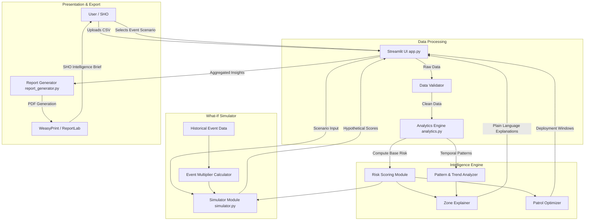

# Architecture & Data Flow

## System Components & Data Flow

Drishti is designed as a lightweight, modular Python application built on Streamlit, allowing for rapid deployment at the station level without requiring complex cloud infrastructure.

## Component Table

| Component | Technology | Responsibility |
|---|---|---|
| **Frontend / Dashboard** | Streamlit, Plotly, HTML/CSS | Renders the interactive UI, heatmaps, and charts. Handles user input for the event simulator. |
| **Data Processing** | Pandas, NumPy | Cleans uploaded CSV data, extracts temporal features (hour, day of week), and aggregates incident counts per zone. |
| **Analytics Engine** | Python (Custom Heuristics) | Computes the multi-factor risk score (Recency + Trend + Baseline). Extracts plain-language explanations for why a zone was flagged. |
| **What-If Simulator** | Python | Calculates historical multipliers for event types (e.g., Festivals) and applies them to current baseline scores to simulate future risk. |
| **Patrol Optimizer** | Python | Analyzes peak incident hours and days for high-risk zones to suggest optimal 3-hour deployment windows. |
| **Report Generator** | ReportLab | Compiles the Top 5 zones, evidence, patrol suggestions, and simulator results into a structured, downloadable PDF brief. |
| **NLP Agent (Future)** | IBM Bob / watsonx.ai | Will allow officers to query the database using natural language (e.g., "Show me theft trends in Area-12"). |

## Security & Scalability Notes
- **MVP State**: The current version processes CSV files entirely in memory using Pandas. This is sufficient for the 6-month synthetic dataset (1000+ records) and ensures no external database dependencies are required for judges to run the demo.
- **Production Path**: For production, the Pandas in-memory processing would be replaced by SQL queries against a PostgreSQL + PostGIS database. The analytics engine would be decoupled into a FastAPI microservice, allowing multiple police stations to query the central district database concurrently.
- **Privacy**: The architecture explicitly does not ingest or process Personally Identifiable Information (PII). All analysis is strictly spatial-temporal and aggregate-based.
